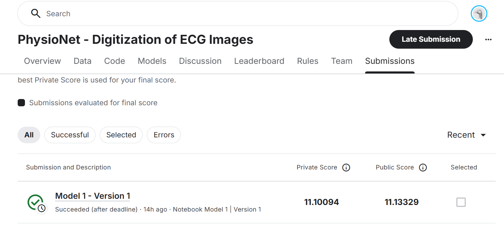

# ECG Image Digitization – Computer Vision Assignment

This repository contains my solution for the **PhysioNet – ECG Image Digitization** Kaggle competition, completed as part of a **Computer Vision course assignment**.

The goal of the competition is to digitize ECG signals from scanned ECG images and reconstruct accurate time-series waveforms using computer vision and machine learning techniques.

---

## 🧠 Problem Overview

Electrocardiograms (ECGs) are often stored as scanned images or paper records. This project focuses on converting ECG images into digital signals that can be analyzed programmatically.

Key challenges include:
- Grid line removal
- Noise and artifacts in scanned images
- Accurate waveform extraction
- Mapping image pixels to time-series signals

---

## 🛠️ Approach

The overall pipeline includes:

1. **Image Preprocessing**
   - Grayscale conversion
   - Noise reduction
   - Grid line suppression
   - Image normalization

2. **Waveform Extraction**
   - Detection of ECG trace pixels
   - Lead separation
   - Signal reconstruction from image coordinates

3. **Post-processing**
   - Signal smoothing
   - Resampling to match ground truth format

4. **Submission Generation**
   - Converted signals formatted according to Kaggle submission requirements

---

## 📊 Kaggle Result

**Public Leaderboard Score:** **11.1**

### 🔍 Score Preview

> Screenshot taken from the Kaggle public leaderboard after successful submission.

---

## Author

**Muhammad Hussain 2022-SE-41** 
